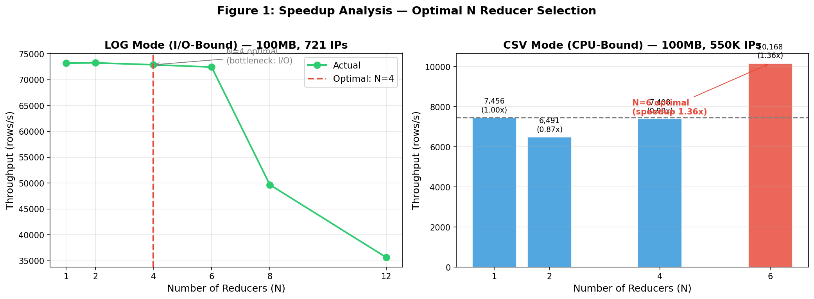
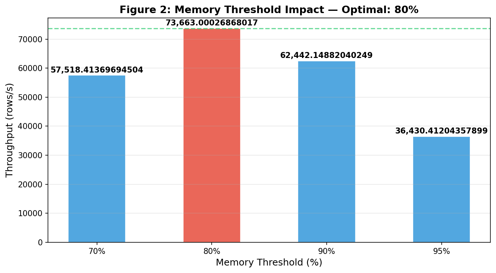
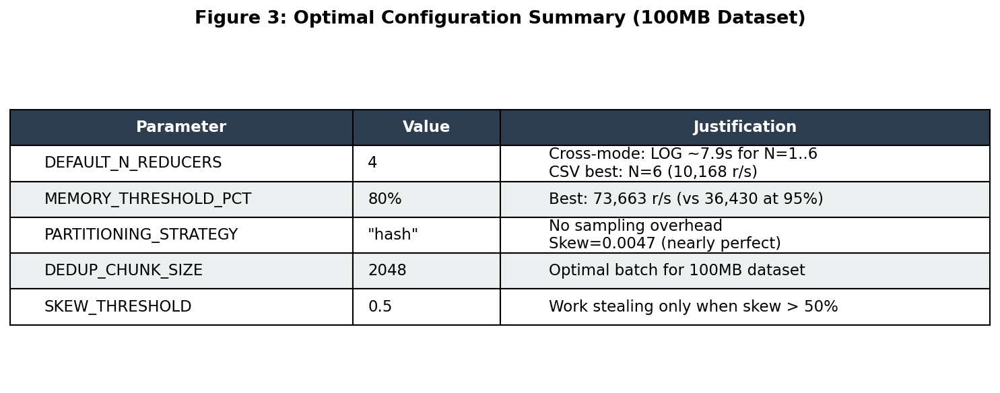

# Distributed ETL Pipeline — Hệ Thống Giám Sát An Ninh Mạng

**SVTH:** Hồ Hoàng Quân — work.huynhhoangquan@gmail.com
**GVHD:** Lê Hà Thanh
**Môn:** Cơ Sở Dữ Liệu Phân Tán

Xây dựng quy trình **ETL phân tán** (Extract-Transform-Load) xử lý dữ liệu log web Apache từ 4 cổng (portal, news, shop, api), theo lý thuyết **Özsu & Valduriez** — *Principles of Distributed Database Systems, 4th Edition*.

**Repo:** https://github.com/HUYNH-HOANG-QUAN/CSDLPT_final

---

## Cách Chạy Nhanh

```bash
# Cài đặt dependencies
pip install -r requirements.txt

# Chạy pipeline (khuyến nghị — 4 cores, 550K unique IPs)
python main.py --csv -r 4 --validate

# Tận dụng 6 cores (max throughput)
python main.py --csv -r 6 --validate

# Dataset với 9K duplicate IPs (test DEDUP_CHUNK_SIZE)
python main.py --csv9k -r 4 --validate

# Benchmark
python main.py --benchmark speedup
```

---

## Các Tính Năng Chính

| Tính năng | Mô tả | O&V Reference |
|-----------|--------|---------------|
| **Horizontal Fragmentation** | Chia data theo site — 4 extractors đọc 4 file song song | Ch.3 |
| **Hash Partitioning** | `hash(IP) % N` định tuyến IP đến reducer tương ứng | Ch.3 |
| **Range Partitioning** | Range + Sampling để cân bằng tải khi data skewed | Ch.3 |
| **Adaptive Work Stealing** | Hot reducer tự động chia tải khi skew > 50% | Ch.8 |
| **Batched Dedup (DEDUP_CHUNK_SIZE)** | Global dedup theo chunk 2048 rows | Ch.8 |
| **Multiprocessing GeoIP** | ProcessPoolExecutor — bypasses GIL, true 6-core parallelism | Ch.8 |
| **Fault Tolerance** | Kill-node detection + partial retry (3 lần) + exponential backoff | Ch.9 |
| **Idempotent Write** | Atomic intermediate file writes — an toàn khi retry | Ch.9 |
| **Speedup / Scaleup / Sizeup** | Benchmark metrics theo O&V scalability analysis | Ch.8 |

---

## Benchmark Kết Quả

### LOG Mode (100MB, 578K rows, 721 unique IPs) — I/O-Bound

| N Reducers | Time (s) | Throughput | Speedup | Efficiency |
|-----------|----------|------------|---------|------------|
| 1 | 7.90 | 73,201 rows/s | 1.00x | 100.0% |
| 2 | 7.89 | 73,244 rows/s | 1.00x | 50.0% |
| 4 | 7.93 | 72,878 rows/s | 1.00x | 24.9% |
| 6 | 7.98 | 72,432 rows/s | 0.99x | 16.5% |
| 8 | 11.63 | 49,693 rows/s | 0.68x | 8.5% |
| 12 | 16.22 | 35,655 rows/s | 0.49x | 4.1% |

**Analysis:** Bottleneck ở Extract phase (regex parsing) → N=1..6 không khác biệt. N>=8 overhead vượt lợi ích.

### CSV Mode (100MB, 550K rows, 100% unique IPs) — CPU-Bound

| N Reducers | Time (s) | Throughput | Speedup |
|-----------|----------|------------|---------|
| 1 | 73.76 | 7,456 rows/s | 1.00x |
| 2 | 84.73 | 6,491 rows/s | 0.87x (slower — Windows spawn overhead) |
| 4 | 74.24 | 7,408 rows/s | 0.99x |
| **6** | **54.09** | **10,168 rows/s** | **1.36x** |

**Analysis:** N=6 tốt nhất cho CSV mode. Khuyến nghị: CSV mode dùng `-r 6`, LOG mode dùng `-r 4`.

### Memory Threshold Sweep

| Threshold | Time (s) | Throughput |
|-----------|----------|------------|
| 70% | 10.05 | 57,518 rows/s |
| **80%** | **7.85** | **73,663 rows/s** |
| 90% | 9.26 | 62,442 rows/s |
| 95% | 15.87 | 36,430 rows/s (GC thrashing) |

**→ MEMORY_THRESHOLD_PCT = 80** (đặt làm default)

---

## Default Parameters (tối ưu cho 100MB dataset)

Tất cả tham số tối ưu nằm trong `src/config.py` → `OPTIMAL_CONFIG`:

```python
OPTIMAL_CONFIG = {
    "n_reducers": 4,             # LOG: N=1..6 same. CSV: use --csv -r 6
    "memory_threshold_pct": 80,   # 80% best (73K r/s). 95% → GC thrashing
    "partitioning": "hash",       # Hash: no overhead. Range: +5s overhead
    "dedup_chunk_size": 2048,     # Optimal batch cho 100MB
    "skew_threshold": 0.5,        # Work stealing when skew > 50%
}
```

### Justification (biểu đồ ở `notebooks/`)

**Figure 1 — Speedup Analysis:**



- **LOG mode** (I/O-bound): N=1..6 cho cùng ~7.9s → bottleneck ở Extract
- **CSV mode** (CPU-bound): N=6 tốt nhất → speedup 1.36x

**Figure 2 — Memory Threshold:**



- **80%** optimal (73,663 rows/s). **95%** → GC thrashing (36,430 rows/s)

**Figure 3 — Optimal Config:**



---

## Kiến Trúc

```
Phase A: Extract + Shuffle
  [csv_portal.csv] → Extractor[1] ─┐
  [csv_news.csv]   → Extractor[2] ─┼──→ hash(IP) % N ──→ Reducer[0..N-1]
  [csv_shop.csv]   → Extractor[3] ─┤
  [csv_api.csv]    → Extractor[4] ─┘                         │
Phase B: Reduce + Transform (Multiprocessing)                 │
  Process[0] → GeoLookup[0] → 137K IPs → reducer_0.json     │
  Process[1] → GeoLookup[1] → 137K IPs → reducer_1.json     │
  Process[2] → GeoLookup[2] → 137K IPs → reducer_2.json     │
  Process[3] → GeoLookup[3] → 137K IPs → reducer_3.json     │
                                                               ▼
Phase C: Load                              Coordinator.merge()
                                                        central_store.json
```

**Fault Tolerance Flow:**
```
1. Orphan cleanup: xóa intermediate files cũ
2. Process timeout: 120s per reducer
3. Failure detection: ProcessPoolExecutor raises exception
4. Partial retry: chỉ retry reducer bị chết (max 3 lần)
5. Exponential backoff: 1.5s, 2.25s, 3.375s...
6. Sequential fallback: chạy tuần tự nếu multiprocessing fails
```

---

## Các Chế Độ Chạy

### Data Source

```bash
# Dataset CSV (550K unique IPs) — khuyến nghị
python main.py --csv

# Dataset CSV với 9K duplicate (640K rows)
python main.py --csv9k

# Dataset log files gốc (578K rows, 721 unique IPs)
python main.py
```

### Partitioning Strategy

```bash
# Hash Partitioning (mặc định) — nhanh, IP distribution đều
python main.py --csv --partition hash

# Range Partitioning (sampling-based) — tốt khi data skewed
python main.py --csv --partition range
```

### Số Reducers

```bash
python main.py --csv -r 1    # baseline
python main.py --csv -r 4    # mặc định
python main.py --csv -r 6    # max CPU
```

### Flags

```bash
python main.py --csv -r 4 --validate   # validation
python main.py --csv -r 4 -v           # verbose debug
python main.py --csv -r 4 -o data/output/my_output.json  # custom output
```

---

## Dataset

| Dataset | Rows | Unique IPs | Duplicates | Use case |
|---------|------|-----------|------------|----------|
| `apache_550k_unique_ips.csv` | 550,000 | 550,000 | 0 | Benchmark, throughput |
| `apache_550k_9k_dup.csv` | 640,000 | 558,999 | 81,000 | Test DEDUP_CHUNK_SIZE |
| Log files | 578,169 | 721 | ~577,448 | Legacy, high dedup |

---

## Cấu Trúc Project

```
CSDLPT_final/
├── main.py                          # Entry point
├── requirements.txt
├── Project_Proposal.md              # Đề xuất đồ án
├── Design_Document.md               # 2 trang design
├── Analysis_Report.md               # O&V theory justification
├── README.md
├── RUN_DEMO.md                      # Hướng dẫn chạy chi tiết
├── src/
│   ├── config.py                    # OPTIMAL_CONFIG
│   ├── hash_fn.py                   # FNV-1a 64-bit hash
│   ├── geo_lookup.py                # MaxMind GeoLite2 (.mmdb)
│   ├── extractor.py                 # Extract + Local Dedup
│   ├── reducer.py                   # Global Dedup (chunked) + Transform
│   ├── load.py                      # Idempotent intermediate files
│   ├── coordinator.py               # Pipeline (Phase A/B/C) + Multiprocessing
│   ├── range_partitioner.py         # Range + Sampling + Work Stealing
│   ├── fault_tolerance.py           # Kill-node detection + partial retry
│   ├── evaluation.py                # Data Skew Detection
│   ├── memory_monitor.py            # Memory Monitoring
│   ├── latency_tracker.py            # Latency Breakdown
│   ├── validation.py                # Correctness Validation
│   ├── benchmark.py                 # Speedup/Scaleup/Sizeup
│   └── sweep_runner.py              # Hyperparameter sweep
├── notebooks/
│   ├── visualize_sweeps.ipynb       # Visualization
│   ├── generate_charts.py           # PNG chart generator
│   ├── speedup_analysis.png
│   ├── memory_threshold.png
│   └── optimal_config.png
└── data/
    ├── GeoLite2-City.mmdb
    └── output/
        ├── central_store.json
        ├── reducer_0.json ... reducer_N.json
        └── sweeps/
```

---

## Evaluation Metrics

| Metric | Mô tả | Công thức |
|--------|--------|-----------|
| **Throughput** | Rows/second | `total_rows / total_time` |
| **Speedup** | Khả năng mở rộng | `T(1) / T(N)` |
| **Scaleup** | Tăng trưởng tuyến tính | `T(N, D) / T(N, αD)` |
| **Sizeup** | Ảnh hưởng data size | `T(N, αD) / T(N, D)` |
| **Skew Factor** | Độ lệch phân phối | `(max - min) / avg` |

---

## Deliverables

| Deliverable | File | Trạng thái |
|-------------|------|-----------|
| Project Proposal | `Project_Proposal.md` | ✓ Hoàn thành |
| Design Document (2 trang) | `Design_Document.md` | ✓ Hoàn thành |
| Analysis Report | `Analysis_Report.md` | ✓ Hoàn thành |
| Code Repository | https://github.com/HUYNH-HOANG-QUAN/CSDLPT_final | ✓ Hoàn thành |
| README + RUN_DEMO | `README.md`, `RUN_DEMO.md` | ✓ Hoàn thành |

---

*Tham khảo: Özsu & Valduriez — Principles of Distributed Database Systems, 4th Edition, Springer 2020*
